*Procedure to deploy E-commerce website Online Boutique which is a microservice application with 11 microservices , which are to be deployed kubernetes (k8s) cluster using deployment and service objects.*

Note - This project is divided in multiple steps , each step being named
as step 1,step 2 and so on. 

**step 1**

Configuration of my current system is

Memory -


Storage -

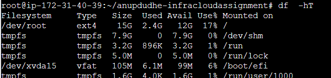

CPU details -

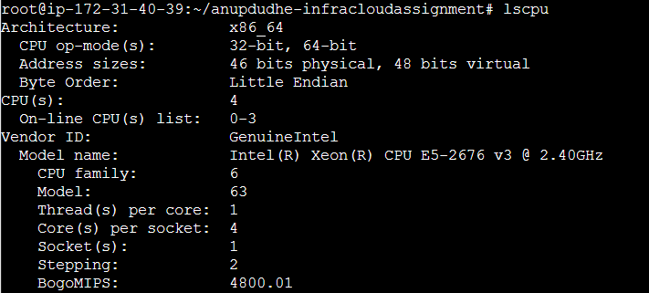

linux debian used - Ubuntu

installing container runtime engine since we are using kind -

we are usng docker as container runtime engine for this project

install docker engine following the link mentioned below
```
https://docs.docker.com/engine/install/

```
install kubectl binary on system following the link mentioned below 

```
https://kubernetes.io/docs/tasks/tools/install-kubectl-linux/
```

install kind on system following the link mentioned below
```
https://kind.sigs.k8s.io/docs/user/quick-start/#installation
```

setting up worker node -

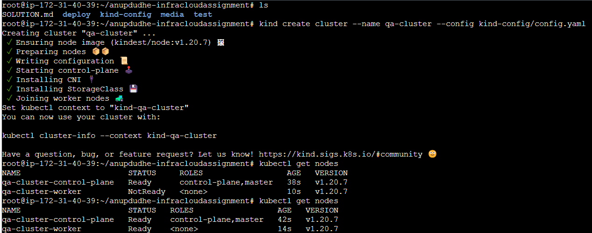

```
kubect get nodes
```

**Step 2**


how to resolve the error of crashloopbackoff for deployment cartsservice
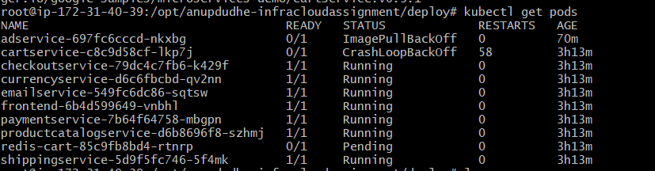

so the issue with this error is we need to authentication to pull images
from gcr

first we will install sdk kit of gcp

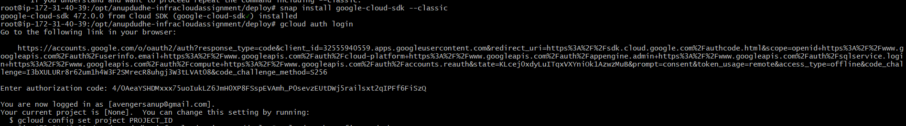

secondly we will do gc autherization login 
it will ask to hit a browser link and in their you will get a key to insert inside the autherization code.

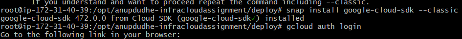

once the autherization is done you will get following prompt


we need to configure docker client by running following command

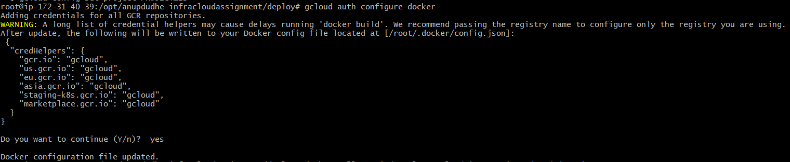

once the authentication of docker engine and gcr is done
we once check wether docker is able to pull image or not manually
```
docker pull gcr.io/google-samples/microservices-demo/cartservice:v0.3.1
```
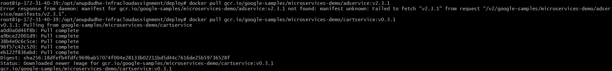

now our docker runtime engine is able to pull gcr image

so the reason why we were facing crashloopbackoff is because 
of authentication with gcr was needed 

heres the error we were facing for cartservice deployment
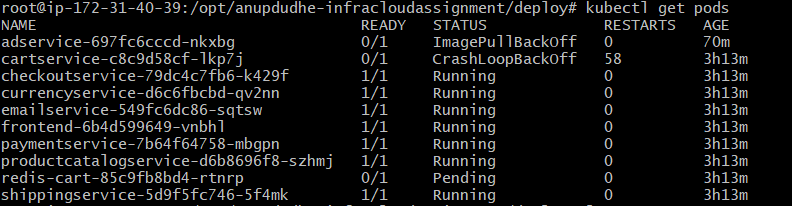

now since we have made neccesary troubleshooting changes

we will once delete the existing deployment

```
kubectl delete -f cartservice.yaml
```

and then once again we will deploy it and now the pod will be up and running

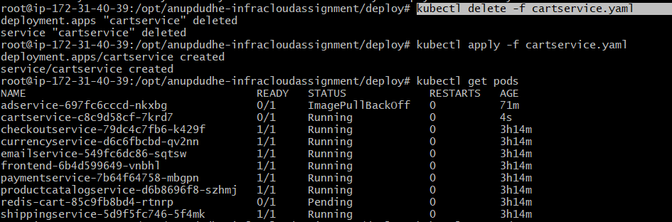

and hence we have troubleshooted the cartservice error.
while cart service was having error with readiness probe and liveness probe

redis pod was in peding state because
redis pod was having issues related to nodeselecor as proper hostname of node was not given


now aprt from adservice pod other all pods are in running state

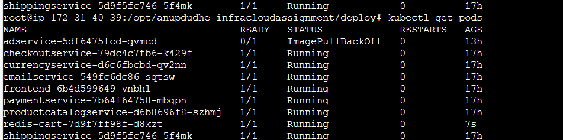

Once your all pods are in running state you will hit command 
```
kubectl port-forward service/frontend-external 28015:80
``` 
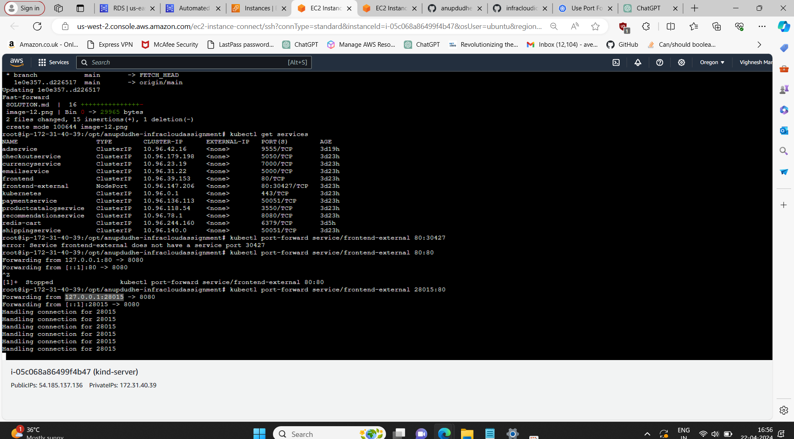

now we will hit 

```
curl localhost:28015 | less
```
now since i am using host as aws ec2 instance 
i am using less

and we will get the website in cli 

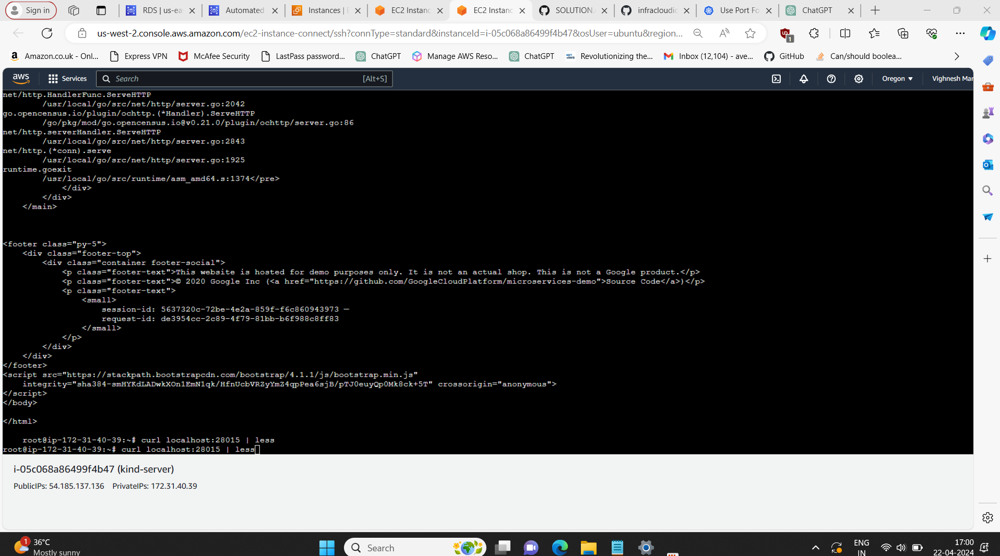


and hence apart from adservice port all other pods are functioning.